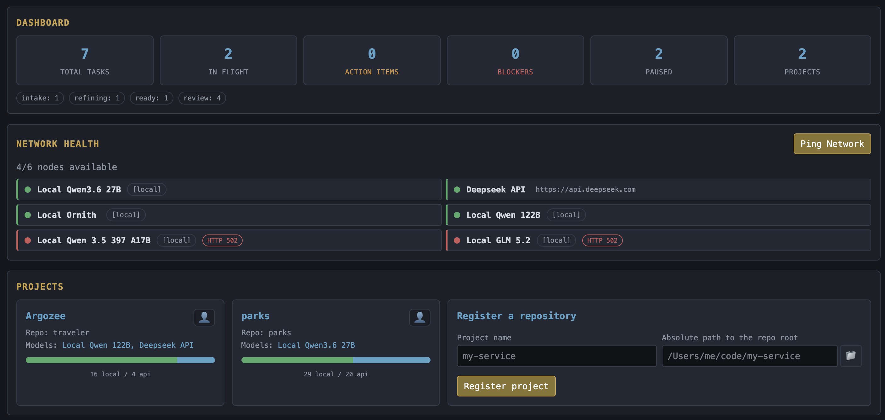
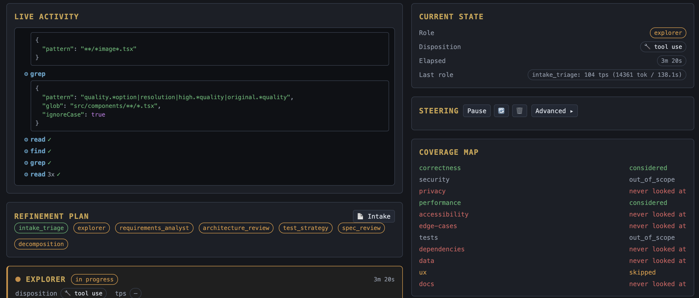
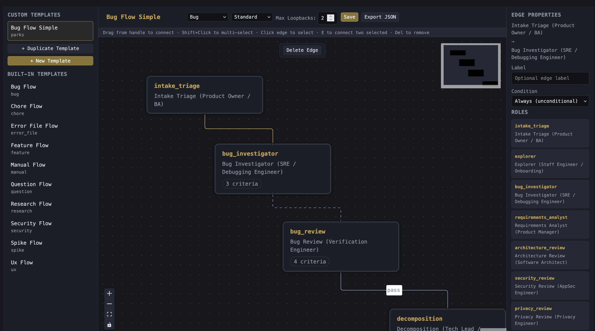
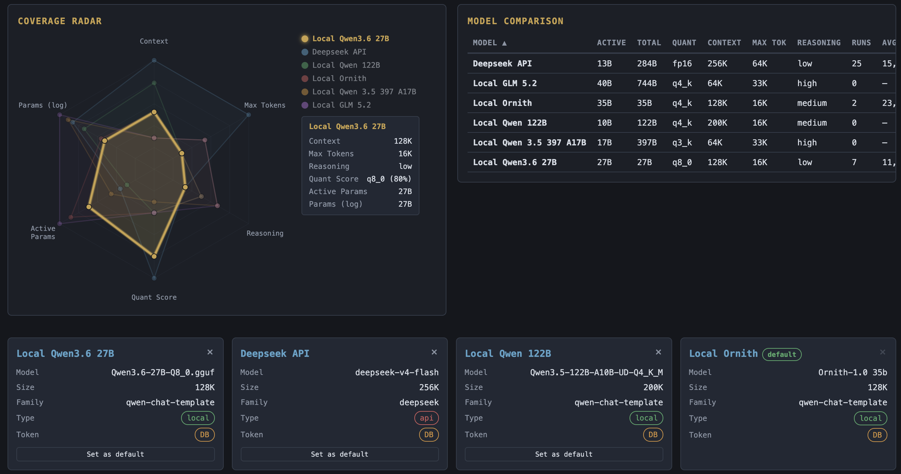

# Orchestra

**A configurable, Git-backed, code-planning refinement utility.**

**[Read the docs →](https://ubcs-io.github.io/orchestra/)**

Connect any git repository, drop in work that ranges from a bare error log to an open-ended research prompt, and a single orchestrator routes it through a chain of specialized "software-company role" agents — powered by [pi](https://github.com/earendil-works/pi) over any OpenAI-compatible endpoint — until it becomes **actionable**: either a decomposed **spec** (epic → story → task) or a **research brief** (approaches, trade-offs, edge cases, recommendation).

The point is **tighter control and visibility over long-running, nebulous work**. LLMs fail at big vague tasks; Orchestra breaks them into tracked steps you can *watch* live, *notice* gaps in (via a coverage map), *steer* mid-run, and *enrich* durably.



---

## How it works

```
INTAKE file / UI  ─►  Orchestrator  ─►  role agents (pi)  ─►  READY  (spec or research brief)
                       (router +          read/grep the           or
                        gatekeeper)       real repo, write     REVIEW (needs human)
                            │             PLANNING artifacts
                            ▼
                    SQLite (source of truth + work queue)
```

1. **Intake.** Drop a file into `<repo>/PLANNING/INTAKE/` (or use the UI). It can be a stack trace, a one-line request, or a research question.
2. **Ingest.** The orchestrator picks it up, creates a task, infers its kind (a `.log`/traceback → `error_file`), seeds a markdown artifact in `PLANNING/REFINING/`, and commits it.
3. **Plan.** A routing template (flow) for the intake kind becomes the task's ordered list of roles. Each flow includes a **counter-reviewer** — a gate role that verifies prior output against predefined acceptance criteria — plus configurable loop-back and rigor settings.
4. **Run.** One role at a time runs as a pi agent session, in that task's own dedicated git worktree: it reads/greps the real repo, then records a structured verdict + a **coverage** declaration (which concerns it examined vs. skipped) + any **open questions** it couldn't fully resolve (each with its own best-effort guess and confidence, so it doesn't have to stall the pipeline) + a markdown section, which is appended to the artifact and committed (`refine(<role>): <task> — <purpose>`). That commit is recorded as the run's checkpoint. Roles that support unreliable models can run in **two-phase** mode (exploration → formalization) or **text mode** (JSON output via markdown instead of native tool calls).
5. **Critique.** Depending on the flow's `reviewDepth` (`none` / `terminal_only` / `every_step`), a scoped adversarial **`critic`** role runs immediately after a step to check that single step's output for a domain-ending violation (PII exposure, authz bypass, irreversible data loss, etc.) — silence is the expected outcome, so it only speaks up for genuine, high-severity issues. Its verdict is folded into the step's effective verdict (never silently downgraded), and it's stored as its own `role_runs` row (`run_kind: "critique"`, linked via `target_run_id`) rather than replacing the primary run.
6. **Gate.** After each role the orchestrator decides: keep refining, escalate to **REVIEW** (an ambiguity/blocker needing a human), or, once the terminal role runs, exit to **READY**. The counter-reviewer checks criteria; unmet "must" criteria loop back to the responsible role (up to `maxLoopbacks` times). A step-level critique blocker can also trigger a bounded loop-back independent of the flow's own reviewer. Spec tasks also spawn an epic→story→task child tree. On exit to READY, the task's dedicated branch is reconciled back into its base branch (best-effort — a conflict is recorded on the task rather than blocking the transition).

State lives in SQLite (the authoritative work queue); the `PLANNING/` tree mirrors it on disk so the refinement history is version-controlled and PR-able.

### Per-task git worktrees & concurrency

Every task runs against its **own git worktree and branch** (`<repo>/.orchestra-worktrees/<taskId>`, off the project's base branch), created the first time the task touches the repo. This means:

- **Tasks run concurrently** — the scheduler dispatches up to `maxConcurrentTasks` (default `3`) tasks' next role-step per round, each isolated in its own worktree, instead of the old strict one-role-at-a-time loop. A single task is still sequential against itself (a restore or answer-reincorporation can never race that task's own in-flight step) — only *distinct* tasks now overlap.
- **Every completed role run leaves a checkpoint** — its post-commit SHA. `POST /api/tasks/:id/restore` (or the Task Detail role-run history) rolls a task back to right after any of its own prior roles, discarding everything after it.
- **Branches reconcile once, on completion** — nothing is merged into your base branch mid-refinement; only the final gate step on Exit to READY merges the task branch back in, after first absorbing base into it.
- **Worktrees are disk-cleaned on delete/reset; branches aren't** — a worktree is silently recreated the next time a task needs one (including after a restore), so no state is lost, just the checkout.

### Intake kinds & flow rigor

Ten intake kinds are supported, each with a dedicated flow:

| Kind | Exit | Rigor | Description |
|---|---|---|---|
| `error_file` | spec | standard | Stack trace or error log → bug investigation |
| `bug` | spec | standard | Described bug report → investigation |
| `security` | spec | high | Vulnerability report → adversarial review |
| `feature` | spec | standard | Feature request → full spec with contracts, schema, security |
| `manual` | spec | standard | Open-ended request → structured spec |
| `chore` | spec | low | Housekeeping → conventions + tests |
| `spike` | spec | low | Exploration → options + feasibility |
| `research` | research_brief | low | Open-ended research → decision brief |
| `ux` | research_brief | low | UX-focused question → design review + brief |
| `question` | research_brief | low | Quick question → options + synthesis |

### Two exit shapes
- **spec** (`error_file`, `bug`, `security`, `feature`, `manual`, `chore`, `spike`) → ends in `decomposition` → an actionable task tree.
- **research_brief** (`research`, `ux`, `question`) → ends in `research_synthesis` → a decision brief.

### Live visibility & steering
- **Live pane** — Server-Sent Events stream the active role's reasoning and every file it reads, in real time, as structured typed events (role/tool boundaries, thinking, text, status) with inline markdown highlighting — not just a raw log.
- **Coverage map** — each role declares which concerns (correctness, security, privacy, performance, accessibility, edge-cases, tests, dependencies, data, ux, docs) it examined, skipped, or ignored, so *omissions are visible* (you can see privacy was never looked at).
- **Steering** — per task you can pause/resume, re-run or **deepen** a role, **inject** a one-off role mid-plan, add a steer note / pin a question, **reset** a task to intake, **restore** it to the git checkpoint left by any of its own prior roles, create child **subtasks**, mark a task **won't do**, or **promote** an injected role into standing project policy that auto-runs on future tasks.
- **Open questions & answer reincorporation** — a role can record open questions it couldn't fully resolve, each with its own best-effort guess and confidence, instead of stalling the pipeline on them. Answer one later (even after the task reaches REVIEW) and, if the optional `answerReincorporation` router advisor is enabled, a genuinely contradicting answer automatically restores the task to that role's checkpoint and re-runs downstream work with the correction.
- **Review CTA & question decomposition** — the Task Detail page surfaces a review call-to-action distilled from the artifact's action items, coverage gaps, and open questions raised by roles; any open question can be spun off with one click into its own child **Question Flow** subtask (`POST /api/tasks/:id/questions/decompose`), which itself gets a full task page (and can recursively decompose its own open questions) plus an inline chat box on the parent for quick follow-up without leaving the page.



### Agent Networks

Beyond the built-in flow templates, you can author custom **agent networks** — visual graphs that define how the orchestrator routes work through role agents. Networks replace a flow template's ordered list with a directed graph of nodes (roles) and edges (transitions), giving you full control over branching, parallelism, and gating logic.

- **Visual editor** — available at `/networks` in the UI. Drag roles from the palette onto a React Flow canvas, connect them with edges to define the work path, and set per-network metadata (intake kind, rigor level, max loopbacks, reviewer role). Nodes are positioned on a snap-to-grid canvas.
- **Built-in system templates** — Orchestra ships with pre-configured networks for common intake kinds (`bug`, `feature`, `security`, `research`, etc.). System networks are read-only; duplicate one to customize it for your project.
- **Custom networks** — create networks from scratch or duplicate and modify a system template. Custom networks are editable: add/remove roles, rewire edges, adjust rigor, and set as the **default** for an intake kind. When set as default, the orchestrator will use your custom network instead of the built-in flow for matching intakes.
- **Import / Export** — networks can be exported to and imported from JSON, making them portable across projects and Orchestra instances. Export from the canvas toolbar; import via the API (`POST /api/networks/import`).

Networks are stored in SQLite alongside projects and are resolved by intake kind: when a task enters the orchestrator, the default network for its intake kind is loaded. If no custom network is set, the built-in flow template is used as a fallback.



### Model dashboard & network ping

The **`/models`** page manages named model configs — reusable endpoint + model profiles (base URL, model ID, context/max-tokens, reasoning/thinking settings, text/two-phase mode, and "tier-1 compat" quirks like `supportsDeveloperRole`, `supportsReasoningEffort`, and stall-nudge thresholds) that a project or role can opt into by referencing the config's name, independent of the single global connection profile. From this page you can:

- **Compare models** — a radar chart and sortable stats table plot each config across context window, max tokens, reasoning, quantization score, effective parameter count, and (log) parameter count, alongside historical usage (runs, total tokens, avg tokens/run) pulled from actual role-run history.
- **Reorder, duplicate, set default** — drag-and-drop cards to set model priority, duplicate a config as a starting point, or promote one to the global default.
- **Ping Network** — from the Projects page, check live connectivity to every configured model endpoint over an SSE stream (`GET /api/ping-network/stream`): each node streams in as `checking → ok/down` with a running "N/M available" count, so you can see at a glance which of your local/tailnet/cloud endpoints are reachable.



### Strategic LLM routing advisors (experimental)

Beyond the deterministic router, `server/src/router.ts` provides five **optional, narrowly-scoped advisory LLM calls** at decision points where heuristics are weakest. Each call point is independently toggleable, off by default, has a hard timeout, and falls back to the heuristic default on failure or when disabled — the orchestrator always owns the final decision:

1. **Question distillation** — after a role produces open questions, distill and de-duplicate them.
2. **Escalation assessment** — before escalating to human REVIEW, decide whether to actually `escalate`, `reroute`, `rerun`, or `close`.
3. **Borderline gate assessment** — for partial-criteria or near-loopback-exhaustion gate decisions, choose `loopback`, `proceed`, `proceed_with_note`, `escalate`, or `narrow_loopback`.
4. **Second review** — after every critiqued step, authoritatively synthesize the primary run and the critic's critique into `accept`, `accept_with_note`, `escalate`, or `loopback` — this is what lets a real critic false-positive get overturned instead of always forcing a loop-back.
5. **Answer match assessment** — when a human answers an open question on a task already at REVIEW, compare the answer against the role's recorded guess: `confirms` or `contradicts`. A `contradicts` result restores the task to that role's checkpoint and re-runs downstream steps with the corrected answer.

---

## Quick start

Requires **Node 20+** and a git repo to point at. An OpenAI-compatible LLM endpoint (Ollama, LM Studio, vLLM, OpenWebUI, …) is needed for roles to actually run.

The repo path you provide when registering a project must be an **absolute path** to a git repository. You can give the repository root, any subdirectory inside it, or even the `.git` directory itself — Orchestra resolves it to the canonical working-tree root automatically. Dragging a folder from Finder (a `file://` URL) or pasting percent-encoded paths is supported transparently.

```bash
npm install                          # installs the server + client workspaces
cp config.example.json config.json   # then set providerBaseUrl / apiKey / defaultModelId
npm run dev                          # Fastify daemon :5001 + Vite dev client :5173
```

Open the client (dev: http://localhost:5173, which proxies `/api` to the daemon). Register a repo, drop an intake, press **Start loop**.

Production-style (single process serves the built SPA + API):

```bash
npm run build      # builds client into server/public, compiles server to server/dist
npm start          # node server/dist/main.js on :5001
```

Other scripts: `npm run typecheck` (both workspaces), `npm run test` / `npm run test:watch` / `npm run test:coverage` (server tests via Vitest).

---

## Configuration

Orchestra has two configuration layers:

1. **Bootstrap config** (`config.json` + `ORCHESTRA_*` env vars) — the static seed used on first boot.
2. **Runtime-editable connection profiles** — stored in SQLite, editable via `PATCH /api/config` and the Settings UI. These take precedence over the bootstrap config, except for `baseUrl` and `apiKey` where env vars always win (so credentials can stay out of the database).

Resolution order (lowest → highest precedence): built-in defaults → `config.json` (repo root, gitignored) → DB global profile → DB project override → `ORCHESTRA_*` environment variables.

| `config.json` key | Env var | Default | Meaning |
|---|---|---|---|
| `host` | `ORCHESTRA_HOST` | `0.0.0.0` | Bind interface (0.0.0.0 so tailnet clients reach it). |
| `port` | `ORCHESTRA_PORT` | `5001` | HTTP port (UI + API + SSE). |
| `providerBaseUrl` | `ORCHESTRA_BASE_URL` | `http://192.168.1.2:8080/v1` | OpenAI-compatible **base** URL (not the `/chat/completions` path). |
| `apiKey` | `ORCHESTRA_API_KEY` | `""` | Bearer token; empty if the endpoint has no auth. |
| `defaultModelId` | `ORCHESTRA_MODEL` | `deepseek-r1:latest` | Model used when a project/role doesn't override. |
| `contextWindow` / `maxTokens` | `ORCHESTRA_MAX_TOKENS` | `128000` / `16384` | Advertised to pi for the local model. |
| `reasoning` | — | `true` | Whether the model is a reasoning model (enables pi thinking level). Set `false` for plain instruct models. |
| `thinkingLevel` | — | `medium` | pi thinking verbosity when `reasoning` is true: `minimal`, `low`, `medium`, `high`, `xhigh`, `max`. |
| `thinkingFormat` | — | `qwen-chat-template` | pi reasoning request dialect for the endpoint. Supported: `qwen-chat-template`, `qwen`, `deepseek`, `zai`, `openai`, `openrouter`, `together`, `string-thinking`, `chat-template`, `ant-ling`. |
| `requestTimeoutMs` | `ORCHESTRA_REQUEST_TIMEOUT_MS` | `300000` | Per-request LLM timeout. |
| `dbPath` | `ORCHESTRA_DB_PATH` | `./orchestra.db` | SQLite file (WAL). |
| `schedulerIdleMs` | `ORCHESTRA_SCHEDULER_IDLE_MS` | `3000` | Idle poll interval when there's no work. |
| `roleToolBudget` | — | `40` | Max tool-calling turns per role run. |
| `maxConcurrentTasks` | `ORCHESTRA_MAX_CONCURRENT_TASKS` | `3` | Max tasks the scheduler runs role-steps for concurrently, each in its own git worktree. |
| `clientDir` | — | `<server>/public` | Built SPA directory served in production. |

### Runtime-editable connection profiles

Beyond the bootstrap config, connection settings are stored in SQLite and editable at runtime via `PATCH /api/config` or the **Settings UI**. These take precedence over `config.json` (except for `baseUrl` and `apiKey`, where env vars always win).

| Field | Default | Description |
|---|---|---|
| `baseUrl` | (from `config.json`) | OpenAI-compatible base URL. |
| `apiKey` | (from `config.json`) | Bearer token. |
| `api` | `openai-completions` | Provider API type. |
| `defaultModelId` | (from `config.json`) | Model ID used when a project/role doesn't override. |
| `contextWindow` / `maxTokens` | (from `config.json`) | Advertised to pi for the local model. |
| `requestTimeoutMs` | (from `config.json`) | Per-request LLM timeout. |
| `reasoning` | (from `config.json`) | Whether the model is a reasoning model. |
| `thinkingLevel` | (from `config.json`) | pi thinking verbosity (`minimal`, `low`, `medium`, `high`, `xhigh`, `max`). |
| `thinkingFormat` | (from `config.json`) | pi reasoning request dialect (e.g. `qwen-chat-template`, `deepseek`, `openai`). |
| `textMode` | `false` | Bypass native tool calls; model outputs structured JSON via markdown instead. |
| `twoPhase` | `false` | Split run into exploration (no tool-calling) + formalization phases. Supersedes `textMode`. Useful when a model's native function calling (`record_findings`) is unreliable. |

> **Prefer a tool-capable model.** Roles use pi's function-calling to read the repo and to record findings. A model without tool support falls back to reasoning over pre-packed context. For unreliable tool-calling models, enable `twoPhase` mode above.

---

## Architecture

One Node process is the whole app — **the server *is* the daemon**. `server/main.ts` boots the DB, seeds the role catalog and connection profile, serves the REST + SSE API and the built client, and starts the orchestrator loop, all in-process. No external broker, queue, or cron: **SQLite is the durable work queue**. Each scheduler round dispatches up to `maxConcurrentTasks` tasks' next role-step concurrently, each in its own git worktree/branch — a single task is still strictly serialized against itself, but distinct tasks now run in parallel rather than taking turns. It's crash-safe — restart and it resumes in-flight tasks from the DB (worktrees are recreated on demand if missing).

- **Backend:** Fastify (REST + SSE), better-sqlite3 (WAL), pi (`@earendil-works/pi-*`) for provider-agnostic, repo-aware agents.
- **Frontend:** Vite + React SPA, TanStack Router + TanStack Query, native `EventSource` for the live stream.

### Project layout

```
server/                one Node daemon (we own main())
  src/main.ts          boots Fastify + orchestrator loop + pi
  src/config.ts        typed bootstrap config (defaults → config.json → env)
  src/settings.ts      runtime-editable connection profiles (DB-backed, inheritable per project)
  src/db.ts            better-sqlite3 schema + CRUD (idempotent, WAL)
  src/providers.ts     pi provider registration + model discovery
  src/agent.ts         runRole(): one pi agent session per role (text mode, two-phase, think splitting)
  src/roles.ts         role catalog (24 roles), flow templates, acceptance criteria, seed data
  src/orchestrator.ts  ingest → plan → run → critique → gate + scheduler + loop-back
  src/router.ts        strategic LLM routing advisors (question distillation, escalation, borderline gate, second review)
  src/git.ts           PLANNING scaffold + sandboxed artifact writes/commits + per-task worktrees + branch reconciliation
  src/bus.ts           in-process pub/sub for the SSE stream
  src/routes/          Fastify REST (api.ts) + SSE (sse.ts) + safety controls (safety.ts)
  test/                Vitest test suite (agent, db, git, orchestrator, roles, router)
client/                Vite + React SPA
  src/routes/          Projects, ProjectBoard (kanban), TaskDetail, RolesEditor, Settings, Models, NetworkEditor
  src/components/      ReviewCTA (review action items + open questions), QuestionDecompose (spin a question into a subtask), NetworkNodeCard
  src/api.ts           typed API client
```

### The `PLANNING/` tree (created per project)

```
<repo>/PLANNING/
  INTAKE/     drop raw intakes / error files here
  REFINING/   in-flight artifacts (one .md per task, growing per role)
  READY/      exit_state = ready_for_work
  REVIEW/     exit_state = needs_review (awaiting a human)
  epics/      epic/story/task decomposition output
```

---

## Roles

24 roles are seeded as global defaults and are **customizable per project** (edit prompt, tools, model, enable/disable — a project override wins by key). Each flow template selects a subset and order per intake kind, with a counter-reviewer gating before the terminal role, and a cross-cutting `critic` role that can run after any non-terminal step depending on the flow's `reviewDepth`.

### Spec-track roles

| Key | Title | Tools | Applies to |
|---|---|---|---|
| `intake_triage` | Intake Triage (Product Owner / BA) | read-only | all |
| `explorer` | Explorer (Staff Engineer / Onboarding) | read-only | all |
| `bug_investigator` | Bug Investigator (SRE / Debugging) | read + git_history | bug, error_file |
| `requirements_analyst` | Requirements Analyst (Product Manager) | none (context-only) | feature, manual, chore |
| `architecture_review` | Architecture Review (Software Architect) | read-only | feature, bug, error_file, manual, spike, security |
| `security_review` | Security Review (AppSec Engineer) | read + git_history | feature, bug, security |
| `privacy_review` | Privacy Review (Privacy Engineer) | read-only | feature, bug, security *(included in security flow; promotable in others)* |
| `performance_review` | Performance Review (Performance Engineer) | read-only | feature, bug |
| `api_design` | API Design (API Designer / Tech Lead) | read-only | feature |
| `data_schema_review` | Data & Schema Review (Data Engineer / DBA) | read-only | feature, bug |
| `style_conventions` | Style & Conventions (Code Reviewer) | read-only | chore, feature |
| `test_strategy` | Test Strategy (QA / SDET) | read-only | feature, bug, error_file, manual, chore, security |
| `dependency_integration` | Dependency & Integration (Build / DevEx) | read-only | feature |
| `decomposition` | Decomposition (Tech Lead / Scrum Master) | read-only | all spec kinds *(terminal role)* |

### Research/UX-track roles

| Key | Title | Tools | Applies to |
|---|---|---|---|
| `ux_review` | UX Review (Product Designer) | read-only | ux |
| `user_research` | User Research (UX Researcher) | none (context-only) | ux, research |
| `options_exploration` | Options Exploration (Staff Engineer / Design Lead) | read-only | research, ux, spike, question |
| `edge_case_analysis` | Edge Case Analysis (QA / Design) | read-only | research, ux, feature |
| `research_synthesis` | Research Synthesis (Tech Lead) | none (context-only) | research, ux, question *(terminal role)* |

### Counter-reviewers (gate roles)

| Key | Title | Tools | Gates |
|---|---|---|---|
| `bug_review` | Bug Review (Verification Engineer) | read + git_history | bug, error_file |
| `security_review_adversary` | Adversarial Security Review (Red Team) | read + git_history | security |
| `spec_review` | Spec Review (Verification Tech Lead) | read-only | feature, manual, chore, spike |
| `brief_review` | Brief Review (Verification Lead) | none (context-only) | research, ux, question |

Counter-reviewers verify prior output against predefined acceptance criteria. If a "must" criterion is unmet, the orchestrator loops back to the responsible role (up to `maxLoopbacks` times). If still unmet after max attempts, the task escalates to **REVIEW** for a human.

### Cross-cutting critique

| Key | Title | Tools | Applies to |
|---|---|---|---|
| `critic` | Critic (Adversarial Domain Reviewer) | none (context-only) | all — runs per-step, scoped to that step's output only |

Unlike the counter-reviewers above (which gate a whole flow against fixed criteria before the terminal role), `critic` runs immediately after an individual step and judges only that step's output, with a deliberately extreme bar: it stays silent unless the step commits a genuine, high-severity domain violation. How often it fires is set per flow by `reviewDepth`:

| `reviewDepth` | Behavior | Used by |
|---|---|---|
| `every_step` | Runs after every non-terminal, non-reviewer step | `security`, `feature` |
| `terminal_only` | Runs once, at the reviewer step | `error_file`, `bug`, `manual`, `chore`, `spike`, `research`, `ux`, `question` |
| `none` | Never runs | — |

`requirements_analyst` is exempt from critique (context-only, no findings to adversarially check). Custom networks expose the same behavior via a per-node `critics` field and network-level `reviewDepth` metadata.

---

## API

REST is served under `/api`; the live stream is SSE. Safety/dev controls are under `/api/safety`.

| Method | Path | Purpose |
|---|---|---|
| GET | `/api/health` | Liveness. |
| GET | `/api/models` | Discover model IDs from the connected endpoint's `/models` route. |
| GET | `/api/concerns` | The concern taxonomy (coverage map dimensions). |
| GET | `/api/flows` | Flow templates per intake kind (steps, criteria, rigor). |
| GET · PATCH | `/api/config` | Global connection profile (read/edit base URL, model, reasoning, thinking, text/two-phase mode). |
| GET · POST | `/api/model-configs` | List / create named model configs. |
| GET · PATCH · DELETE | `/api/model-configs/:id` | Get / update / delete a named model config. |
| POST | `/api/model-configs/:id/duplicate` | Duplicate a model config. |
| POST | `/api/model-configs/:id/set-default` | Set a model config as the global default. |
| POST | `/api/model-configs/reorder` | Reorder model configs (drag-and-drop priority). |
| POST | `/api/model-stats` | Radar/stats-table data per model config (params, quant score, cost, historical usage). |
| GET | `/api/ping-model/:id` | Live connectivity check against a single model config. |
| GET | `/api/ping-network/stream` | SSE: live connectivity check against every configured model endpoint. |
| GET | `/api/roles` | List all roles, global + merged with a project's overrides. |
| GET | `/api/roles/stats` | Per-role-key usage stats (calls, pass count, counter-reviewer passes, network count, total tokens) aggregated across all projects. |
| GET | `/api/scheduler` · POST `/api/scheduler/{start,stop}` · POST `/api/tick` | Loop control / manual single step. |
| GET · POST | `/api/projects` · GET · PATCH · DELETE `/api/projects/:id` | Projects. |
| GET | `/api/projects/:id/roles` · PUT `/api/projects/:id/roles/:key` | Per-project role config (prompt, tools, model, enabled). |
| POST | `/api/projects/:id/intake` | Submit an intake (writes into `INTAKE/`). |
| POST | `/api/tasks` | Create a manual task (without a repo file). |
| GET | `/api/networks` | List all networks (system + custom). |
| POST | `/api/networks` | Create a custom network. |
| GET | `/api/networks/:id` | Get a single network. |
| PATCH | `/api/networks/:id` | Update a custom network. |
| DELETE | `/api/networks/:id` | Delete a custom network. |
| POST | `/api/networks/:id/duplicate` | Duplicate a network (custom or system). |
| POST | `/api/networks/default/:intakeKind` | Set a network as default for an intake kind. |
| POST | `/api/networks/import` | Import a network from JSON. |
| GET | `/api/networks/export/:id` | Export a network as JSON. |
| POST | `/api/networks/:id/reset` | Reset a custom network to its original. |
| GET | `/api/tasks` · GET · DELETE `/api/tasks/:id` | Tasks + full detail (runs, coverage, plan, children, flow). |
| PATCH | `/api/tasks/:id` | Edit a task's name/content while in intake stage. |
| POST | `/api/tasks/:id/reset` | Reset a task to intake state (clears history). |
| POST | `/api/tasks/:id/restore` | Roll a task back to the git checkpoint left by one of its own role runs (`{ role_run_id }`). |
| POST | `/api/tasks/:id/subtasks` | Create a child task under a parent. |
| POST | `/api/tasks/:id/questions/decompose` | Spin an open review question off into its own child Question Flow subtask (idempotent per question). |
| POST | `/api/tasks/:id/chat` | Send a follow-up chat message against a task (used by the inline decomposed-child preview). |
| POST | `/api/tasks/:id/interventions` | Steering: `pause`/`resume`/`deepen`/`inject_role`/`steer_note`/`pin_question`/`promote_role`/`run_now`/`wont_do`/`question_answer`. |
| GET | `/api/tasks/:id/stream` | SSE: live role/tool/text events. |
| GET · PATCH | `/api/safety` | Safety/pi dev controls (read agent boundaries, limits, gates, role summary; edit `role_tool_budget`). |

---

## Deployment (headless / tailnet)

The single process is designed to run on a headless box under **systemd** (or pm2/Docker with a restart policy), bound to the tailnet interface; other clients reach the UI/API/SSE over Tailscale. There is **no auth** — the tailnet is the trust boundary. Multiple clients can watch and steer the same task concurrently; steering actions are POSTs, up to `maxConcurrentTasks` tasks execute their role-steps in parallel (each in its own worktree), a given task's own steps/restores are still serialized against each other, and SSE fans live progress to every viewer.

---

## Status

The full pipeline — ingest, planning, concurrent role execution across per-task git worktrees (including two-phase and text mode for unreliable tool-calling models), per-step adversarial critique, gating with counter-reviewers and loop-back, checkpoint restore, branch reconciliation, optional LLM routing advisors (including answer reincorporation), coverage rollup, decomposition, artifacts/commits, SSE, runtime-editable connection profiles, named model configs with usage stats and network ping, and the React UI — is implemented and typechecks/builds. Successful *LLM* refinement depends on a reachable tool-capable endpoint (set `providerBaseUrl`). A Vitest test suite covers the agent (think splitting, stall detection, text-mode extraction), orchestrator (plan mutation, gating, loop-back, interventions, critique, concurrent scheduling), router (advisory call points, fallback behavior), database, git operations (worktrees, reconciliation), and roles.